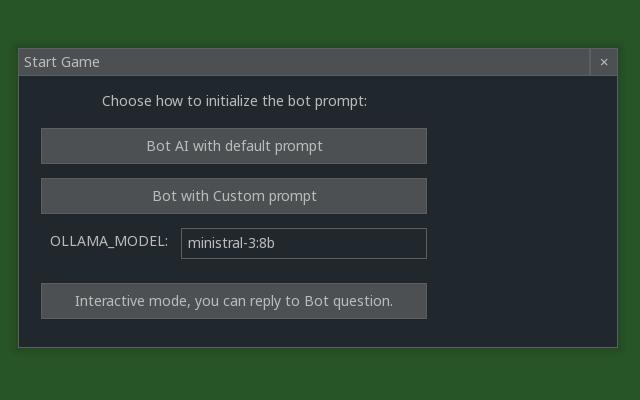

## B.O.T.S. 

**Brutal** It will burns through your GPU wattage just to achieve the bare minimum. It is as unforgiving on your hardware as the planet is on the bot.

**Ollama** This is the local LLM engine powering the bot's "brain" (and its attitude).

**Trek**   The robot is forced to traverse a vast, hostile landscape where every step is a struggle.

**Survival** And it is stranded on a far-off planet with dwindling resources and a very short fuse.

**bots** is a survival game built with Pygame Zero where prompt design is part of the gameplay. You can customize the mission prompt sent to the Ollama-controlled bot, shaping how it prioritizes energy, scouting, and habitat use to survive recurring solar flares. The story setup: your expedition is chasing signals from a black hole, but communication bandwidth is extremely limited, so only short text instructions can be transmitted. That constraint is why this project uses the prompt as the control channel—write better instructions, and the bot makes better survival decisions under pressure.

## Screenshot


[How should the robot run?](https://youtu.be/bCgY5f4Rm9s)


## Commands

### Build/Install
```bash
poetry install
```

### Run the Game
```bash
poetry run bots
```

### Run with LLM (Autonomous Mode)
```bash
OLLAMA_PLAY=1 poetry run bots
```
When the program starts you can execute or edit a default prompt for the robot.
Allow the program to intercept question from the robot and ask you whatever.
Change a different LLM model.



### Core Files

- **`bots/game.py`** - Thin Pygame Zero entrypoint/orchestrator (~60 lines):
  - Initializes world and optional Ollama play thread
  - Exposes `update(dt)` and `draw()` expected by `pgzero`
  - Wires pygame_gui event handling

- **`bots/game_logic.py`** - Core game state and mechanics (~790 lines):
  - Tile/map data structures and procedural generation
  - Solar flare countdown system (20 steps between flares)
  - Habitat damage tracking (0-100% per habitat)
  - Bot actions and tool functions (`MoveTo`, `LookClose`, `LookFar`, `OpenCrate`, `TakeAllFromCrate`, `RepairHabitat`)
  - Movement update loop and status helpers
  - Line-of-sight calculations for blocking terrain

- **`bots/rendering.py`** - Drawing/UI layer (~280 lines):
  - Map viewport rendering with dynamic camera
  - Bot sprite rendering
  - Solar flare flash animation (10 flashes over 2 seconds)
  - 4 draggable pygame_gui windows:
    - **Bot Stats**: Energy, position, state, solar flare countdown, habitat repair progress
    - **Message Log**: Captured print() output
    - **Bot Speech**: Last LLM response
    - **User Input**: (Placeholder for future direct steering)
  - Font preloading to prevent warnings
  - HTML text caching for performance

- **`bots/message_log.py`** - Print output capture (~50 lines):
  - Intercepts sys.stdout/stderr to populate Message Log window
  - Thread-safe deque buffer (max 1000 lines)

- **`bots/ollama_agent.py`** - Ollama integration (~280 lines):
  - Mission prompt: "Repair all damaged habitats!"
  - Tool schema definitions for 6 bot actions
  - Tool-calling loop with step-based execution
  - Model lifecycle helpers

- **`bots/cli.py`** - CLI entry point:
  - Launches game via `pgzrun`

### Dependencies

- **pgzero** - Pygame Zero game framework (v1.2.1+)
- **ollama** - Python client for Ollama AI (v0.6.1+)
- **pygame-gui** - GUI library for movable windows (v0.6.0+)
- **Python** - 3.12+

### Environment Variables

| Variable | Default | Description |
|----------|---------|-------------|
| `OLLAMA_MODEL` | `ministral-3:8b` | Ollama model for LLM play mode |
| `OLLAMA_PLAY` | `0` | Enable LLM autonomous play (set to 1 to enable) |

### License

This project is licensed under the MIT License.
See [LICENSE](LICENSE) for details.
