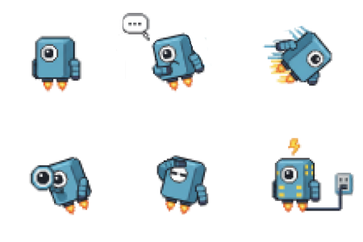

# bots

A local LLM plays a small tile survival game: a robot explores a grid world,
scans terrain, digs rocks, builds habitats / batteries / solar panels, and
tries to stay charged through periodic solar flares. The game runs in native
C with raylib; the model runs locally via `llama.cpp`'s OpenAI-compatible
server.

[Short video demo (YouTube)](https://youtu.be/esa-aX58YaI) ·
[Tower-defense mode demo (YouTube)](https://youtu.be/aLs3Lp73xuk)



## Requirements

- A C17 compiler (gcc / clang)
- CMake ≥ 3.20 and `make`
- Network + git (CMake's `FetchContent` pulls raylib 5.5 and raygui 4.0 on
  first build)
- X11 / Wayland dev headers that raylib needs on Linux
  (`libxrandr`, `libxinerama`, `libxcursor`, `libxi`, `libgl1-mesa-dev`, …)
- A [`llama.cpp`](https://github.com/ggerganov/llama.cpp) build of
  `llama-server` and any tool-calling-capable GGUF model (tested with
  `Ministral-3-8B-Reasoning` and Qwen 2.5 variants)

Optional: a monospace TTF somewhere on the system (Ubuntu Mono, DejaVu
Sans Mono, or Liberation Mono). The HUD auto-detects one of these and
falls back to raylib's bitmap font if none is found.

## Build

```bash
cd bots-c
cmake -S . -B build
cmake --build build -j
```

The resulting executable is `bots-c/build/bots`.

## Run

**1. Start the LLM server** (in another terminal):

```bash
./start-llama-server.sh [/path/to/model.gguf]
```

The script starts `llama-server` on `127.0.0.1:8080` with:

- `-c 16384` — 16k context (reasoning models burn through 8k quickly)
- `--jinja` — use the GGUF's embedded chat template (required for
  tool-calling / reasoning models)
- `--reasoning-format deepseek` — hide the model's internal `<think>…</think>`
  trace from the client

The bundled script also sets up ROCm library paths for AMD GPUs. Edit it
(`LLAMA_DIR`, `DEFAULT_MODEL`, the `HIP_*` env vars) to point at your own
binaries, or just run `llama-server` yourself with the same flags — the
client only cares that there's an OpenAI-compatible endpoint at
`http://127.0.0.1:8080/v1/chat/completions`.

**2. Start the game:**

```bash
./bots-c/build/bots
```

The start menu lets you pick:

- **Scenario** — *Explorer* (maximise distance covered) or
  *Builder* (maximise structures placed)
- **Rocks amount** — density of rock clusters in the procedural map
- **Initial town size** — pre-placed habitat cluster (0 to disable)
- **Starting energy** and **starting inventory rocks**
- **Hours between solar flares**
- **Interactive mode** — pause when the bot asks a `?` question and let
  you type a reply before the turn continues
- **Custom prompt** — override the built-in mission prompt

`F11` toggles fullscreen. Pan with right-mouse drag, zoom with the
scroll wheel.

## How LLM ↔ tools ↔ world fit

**`game_logic.c`** owns the 2D tile matrix, bot stats (energy, inventory,
position), solar-flare schedule, and the real implementations of the
tools: `MoveTo`, `LookFar`, `Dig`, `Create`, `ListBuiltTiles`. Each tool
mutates shared state behind `gl_tiles_lock` / `gl_built_lock` and returns
a `ToolResult` containing a JSON string (`ok`, new position, energy,
`hours_to_solar_flare`, and diagnostic fields like `previous_tile_type`
or a `note` when relevant).

**`llm_agent.c`** runs the model loop on a background thread:

1. Builds an OpenAI-style `tools` array describing each game function
   and its JSON parameters (`build_tools_json`).
2. Prepends a `SYSTEM STATUS` line every turn with the current hour,
   energy, position, `current_tile_buildable`, inventory, flare ETA,
   and a diagnosed `habitat_hourly_charge_active` reason. That way the
   model doesn't have to remember prior state.
3. Calls `http_post` → `POST /v1/chat/completions` on
   `127.0.0.1:8080`, parses `tool_calls` from the assistant message,
   dispatches them via `gl_dispatch_tool_call`, and appends the JSON
   result as a `tool` message for the next turn.
4. `--reasoning-format deepseek` means the server strips the
   `<think>…</think>` trace; we keep the last 30 hours of chat history
   and feed it back each turn.

**`main.c`** is a classic raylib loop: draw the game, update particles,
poll input, render the HUD (stats panel on the top-left, scrollable
`SYSLOG` at the bottom). The LLM thread runs independently; the game
clock is driven by the agent loop taking a turn, not by real time.

### Tool API (what the model sees)

| Tool            | Effect                                                                 | Cost            |
|-----------------|------------------------------------------------------------------------|-----------------|
| `MoveTo(x,y)`   | Pathfind to `(x,y)`. Advances one hour per tile of path.               | 1 energy / tile |
| `LookFar`       | Scans the surrounding area, clears fog of war, returns notable tiles.  | 1 energy        |
| `Dig`           | Consumes a `rocks` tile under the bot → `+1 rocks` inventory, tile becomes gravel. | 1 energy  |
| `Create(type)`  | Builds `habitat`, `battery`, or `solar_panel` on current buildable tile. | 1 energy + rock cost |
| `ListBuiltTiles`| Returns every structure the bot has placed this run.                   | 1 energy        |

Buildable ground is gravel, sand, or rocks (creating on rocks consumes
that rocks tile permanently). Power requires orthogonal adjacency
(`|dx|+|dy|=1`) between at least one habitat, one battery, and one
solar_panel; the bot only charges while standing on a habitat in such a
cluster.

## Layout

| File                  | Role                                                     |
|-----------------------|----------------------------------------------------------|
| `bots-c/src/main.c`      | Raylib main loop, HUD panels, reply dialog           |
| `bots-c/src/game_logic.c`| Map, tools, solar flares, power network, particle spawns |
| `bots-c/src/rendering.c` | Viewport camera, tile / bot drawing                  |
| `bots-c/src/particles.c` | Scan pulses, build sparkles, dig dust, flare zaps    |
| `bots-c/src/start_menu.c`| Start screen (raygui), scenario + custom prompt      |
| `bots-c/src/ui_theme.c`  | Hacker-terminal raygui theme + TTF font loader       |
| `bots-c/src/llm_agent.c` | OpenAI-compatible chat + tool-call loop              |
| `bots-c/src/http_post.c` | Minimal sockets-based HTTP POST                      |
| `bots-c/src/cJSON.c`     | Vendored cJSON parser                                |
| `bots-c/src/message_log.c`| Ring buffer that feeds the SYSLOG panel             |
| `start-llama-server.sh`  | Convenience launcher for `llama-server`              |

**Stack:** C17, raylib 5.5, raygui 4.0, pthreads, cJSON, llama.cpp server.

## License

MIT — see [LICENSE](LICENSE).
