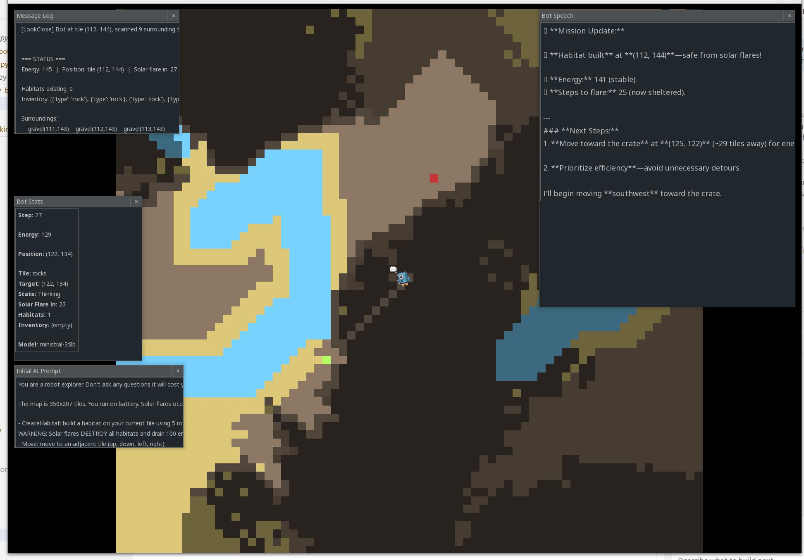

## B.O.T.S. 

**Brutal** It will burns through your GPU wattage just to achieve the bare minimum. It is as unforgiving on your hardware as the planet is on the bot.

**Ollama** This is the local LLM engine powering the bot's "brain" (and its attitude).

**Trek**   The robot is forced to traverse a vast, hostile landscape where every step is a struggle.

**Survival** And it is stranded on a far-off planet with dwindling resources and a very short fuse.

**bots** is a survival game built with Pygame Zero where prompt design is part of the gameplay. You can customize the mission prompt sent to the Ollama-controlled bot, shaping how it prioritizes energy, scouting, and habitat use to survive recurring solar flares. The story setup: your expedition is chasing signals from a black hole, but communication bandwidth is extremely limited, so only short text instructions can be transmitted. That constraint is why this project uses the prompt as the control channel—write better instructions, and the bot makes better survival decisions under pressure.

## Screenshot



## Commands

### Build/Install
```bash
poetry install
```

### Run the Game
```bash
poetry run bots
```

### Run with LLM (Autonomous Mode)
```bash
OLLAMA_PLAY=1 poetry run bots
```

### Run a Single Test (if tests exist)
```bash
poetry run pytest <test_name>  # or poetry run python -m pytest ...
```

## Architecture

### Core Files

- **`bots/game.py`** - Thin Pygame Zero entrypoint/orchestrator (~60 lines):
  - Initializes world and optional Ollama play thread
  - Exposes `update(dt)` and `draw()` expected by `pgzero`
  - Wires pygame_gui event handling

- **`bots/game_logic.py`** - Core game state and mechanics (~790 lines):
  - Tile/map data structures and procedural generation
  - Solar flare countdown system (20 steps between flares)
  - Habitat damage tracking (0-100% per habitat)
  - Bot actions and tool functions (`MoveTo`, `LookClose`, `LookFar`, `OpenCrate`, `TakeAllFromCrate`, `RepairHabitat`)
  - Movement update loop and status helpers
  - Line-of-sight calculations for blocking terrain

- **`bots/rendering.py`** - Drawing/UI layer (~280 lines):
  - Map viewport rendering with dynamic camera
  - Bot sprite rendering
  - Solar flare flash animation (10 flashes over 2 seconds)
  - 4 draggable pygame_gui windows:
    - **Bot Stats**: Energy, position, state, solar flare countdown, habitat repair progress
    - **Message Log**: Captured print() output
    - **Bot Speech**: Last LLM response
    - **User Input**: (Placeholder for future direct steering)
  - Font preloading to prevent warnings
  - HTML text caching for performance

- **`bots/message_log.py`** - Print output capture (~50 lines):
  - Intercepts sys.stdout/stderr to populate Message Log window
  - Thread-safe deque buffer (max 1000 lines)

- **`bots/ollama_agent.py`** - Ollama integration (~280 lines):
  - Mission prompt: "Repair all damaged habitats!"
  - Tool schema definitions for 6 bot actions
  - Tool-calling loop with step-based execution
  - Model lifecycle helpers

- **`bots/cli.py`** - CLI entry point:
  - Launches game via `pgzrun`

### Dependencies

- **pgzero** - Pygame Zero game framework (v1.2.1+)
- **ollama** - Python client for Ollama AI (v0.6.1+)
- **pygame-gui** - GUI library for movable windows (v0.6.0+)
- **Python** - 3.12+

### Environment Variables

| Variable | Default | Description |
|----------|---------|-------------|
| `OLLAMA_MODEL` | `qwen3.5:9b` | Ollama model for LLM play mode |
| `OLLAMA_PLAY` | `0` | Enable LLM autonomous play (set to 1 to enable) |

### Tile System

- **Map dimensions**: 1000x700 pixels
- **Total window**: 1200x950 pixels (includes UI panels)
- **Tile size**: 10x10 pixels
- **Grid size**: 100 columns x 70 rows
- **Viewport**: 70x70 tiles visible
- `Tile` dataclass: x, y, type, color (RGB tuple), description (str), fog (bool)
- `tile_matrix[x][y]` - 2D list of `Tile` objects
- Thread-safe tile dictionary + matrix with `tiles_lock` Lock

### Tile Types and Colors

| Type | Color (RGB) | Description | Movement |
|------|-------------|-------------|----------|
| gravel | (140, 120, 100) | Loose red gravel and dust | 5 tiles/action |
| sand | (220, 200, 120) | Warm, loose sand | 5 tiles/action |
| water | (120, 210, 255) | Clear, shimmering water | Impassable |
| rocks | (90, 80, 70) | Jagged rocks and boulders | Blocks line-of-sight |
| habitat | (180, 255, 100) | Sealed habitat module (repaired) | Safe from solar flares |
| broken_habitat | (40, 70, 40) | Damaged habitat module | Becomes habitat when repaired |
| crate | (200, 50, 50) | Red crate containing energy cells | 5 tiles/action |

### Solar Flare Mechanics

- **Countdown**: Every 20 bot actions, a solar flare occurs
- **Safety**: Bot must be on a habitat tile to survive
- **Death**: If caught outside during a flare, bot is destroyed (energy → 0)
- **Animation**: Yellow screen flashes 10 times over 2 seconds when bot dies
- **Visibility**: Countdown displayed in all tool responses and Bot Stats window

### Habitat Repair System

- **Damage**: Each habitat tile has 0-100% damage (randomly initialized)
- **Repair Cost**: 10 energy total (5 energy per step × 2 steps)
- **Process**: RepairHabitat must be called twice consecutively at same location
- **Progress Tracking**: UI shows "Repair in progress: X/2" and repair count
- **Visual Feedback**: Broken habitats are dark green (40, 70, 40), repaired habitats are bright lemon-green (180, 255, 100)
- **Mission Goal**: Repair all damaged habitats before solar flares destroy the bot

### Ollama Integration

The game uses Ollama's tool-calling API to let an LLM autonomously control the bot. When `OLLAMA_PLAY=1`, a daemon thread runs the tool-calling loop:

1. Sends mission prompt: "Repair all damaged habitats on Mars!"
2. LLM calls tools to explore, collect energy, and repair habitats
3. Tool results include solar flare countdown and habitat damage info
4. Loop continues until all habitats repaired or bot destroyed

**LLM Tools:**

| Tool | Energy Cost | Description |
|------|-------------|-------------|
| `MoveTo(target_x, target_y)` | 1 per tile | Move toward target tile coordinates (limited by terrain) |
| `LookClose()` | 1 | Returns 3×3 grid around bot with tile types and habitat damage |
| `LookFar()` | 1 | Scans 20-tile radius, reports nearest feature of each type, includes blocking obstacles |
| `OpenCrate()` | 1 | Opens crate at current position, reveals energy inside |
| `TakeAllFromCrate()` | 1 | Collects all energy from opened crate, removes crate |
| `RepairHabitat()` | 5 | One step of 2-step repair process, restores habitat to 0% damage |

### Key Functions

| Function | Purpose |
|----------|---------|
| `CreateTile(x, y, type)` | Thread-safe tile placement (returns dict with status) |
| `MoveTo(target_x, target_y)` | Move bot toward target coordinates, advance solar flare countdown |
| `LookClose()` | Read 3×3 grid around bot with habitat damage info |
| `LookFar()` | Scan 20-tile radius, report blocking tiles and features |
| `OpenCrate()` | Open crate at current position |
| `TakeAllFromCrate()` | Collect energy from opened crate |
| `RepairHabitat()` | 2-step repair process for damaged habitats |
| `_advance_solar_flare_step()` | Countdown solar flare timer, check safety, trigger animation |
| `_is_line_of_sight_blocked()` | Bresenham algorithm to check if rocks/habitats block view |
| `_build_scenery_procedural()` | Procedural Mars terrain generation |
| `initialize_world()` | Initialize tiles and generate map |

## Implementation Notes

- Bot movement uses smooth interpolation with `BOT_SPEED = 220` pixels/second
- Bot bounds-checked against `BOT_RADIUS` (10px)
- Tile updates are protected by threading lock for Ollama request safety
- Map is procedurally generated with lakes, rock clusters, sand patches, habitat sites, and energy crates
- Solar flare countdown advances with every bot action (not time-based)
- Line-of-sight uses Bresenham's algorithm to identify blocking obstacles
- Habitat repair requires 2 consecutive RepairHabitat calls at same location
- LLM sees habitat damage percentages via LookClose and LookFar tools
- Fog of war system: tiles start hidden, revealed by LookClose/LookFar/MoveTo
- pygame_gui windows are draggable and update dynamically with game state
- Fonts preloaded (noto_sans 12-18pt) to eliminate pygame_gui warnings
